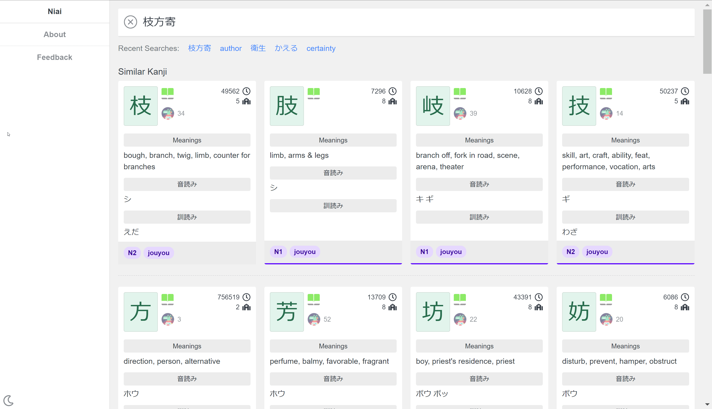

# CSS Theming

[](https://www.npmjs.com/package/css-theming)
[](https://opensource.org/licenses/MIT)

A platform for CSS theming.

Uses modern CSS and SCSS. Color contrast is at least AA compatible by default!



<p align="center">from http://niai.mrahhal.net</p>

## At a Glance

- Themes and theme category management
- Colors and their swatches automatically computed for light/dark themes
- Foregrounds, backgrounds, borders
- Support for icons/svgs
- Programmatic access

## Course

Please consider buying the course here: [TODO]

It contains a deep dive into the problems involved with creating themes and their solutions.

## Install

```
npm i css-theming --save
```

## Sample

The main sample app is in the "sample" folder in this repo, written in Vue.

## Sites Using `css-theming`

- http://niai.mrahhal.net
